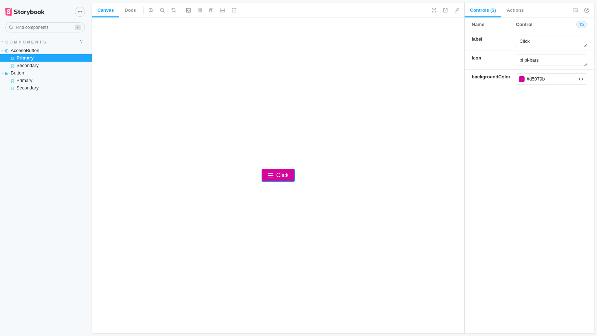

# Description
Poc Library Primereact Components implemented by Storybook

We crete a component library to package our PrimeReact components using the framework Storybook

# Create a react component library
- Create a new folder with whatever name you want for your component library

```shell
mkdir poc-react-component-library
cd poc-react-component-library

```

- Initialize your npm projec

```shell
yarn init
git init

```

- set up your .gitignore
```shell
node_modules/
lib/
```

- install react and typescript dependencies

```shell
yarn add --dev react react-dom @types/react typescript

```

- Since react requires that we need to have a single copy of react-dom, we will be adding it as a peerDependency so that our package always uses the installing client's version


```shell
...
"peerDependencies": {
    "react": "^16.8.0",
    "react-dom": "^16.8.0"
 },
...
```

- Add a tsconfig for compiling our TypeScript

```shell
{
    "compilerOptions": {
      "target": "es5",
      "outDir": "lib",
      "lib": [
        "dom",
        "dom.iterable",
        "esnext"
      ],
      "declaration": true,
      "declarationDir": "lib",
      "allowJs": true,
      "skipLibCheck": true,
      "esModuleInterop": true,
      "allowSyntheticDefaultImports": true,
      "strict": true,
      "forceConsistentCasingInFileNames": true,
      "module": "esnext",
      "moduleResolution": "node",
      "resolveJsonModule": true,
      "isolatedModules": true,
      "noEmit": true,
      "jsx": "react"
    },
    "include": [
      "src"
    ],
    "exclude": [
        "node_modules",
        "lib"
    ]
  }
  ```

## Install Storybook

```shell
npx sb init
```

## Install PrimeReact

```shell
npm install primereact
npm install primeicons
```

and add dependencies inside 

## Develop the storybook library componenst

Storybook Component sample



## Start Storybook UI Designer

Start the Storybook UI executing:

```shell
yarn storybook
```

Open the Storybook UI from this URI:

```shell
http://localhost:6006/
```
